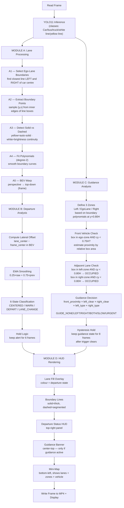

# ADAS — Full Project Logic & Flow
### Vision-Based Lane Departure + Directional Guidance System

---

## Table of Contents

1. [Project Big Picture](#1-project-big-picture)
2. [What the System Detects](#2-what-the-system-detects)
3. [Module A — Lane Detection & Ego-Lane Tracking](#3-module-a--lane-detection--ego-lane-tracking)
4. [Module B — Lane Departure Warning](#4-module-b--lane-departure-warning)
5. [Module C — Directional Guidance (Overtaking Assist) ⭐](#5-module-c--directional-guidance-overtaking-assist)
6. [Module D — HUD Rendering & Display](#6-module-d--hud-rendering--display)
7. [Full Per-Frame Decision Flow (All Modules Combined)](#7-full-per-frame-decision-flow-all-modules-combined)
8. [Complete Output State Table](#8-complete-output-state-table)
9. [Tuning Reference](#9-tuning-reference)

---

## 1. Project Big Picture

The system reads a dashcam video frame by frame and produces a live
annotated output that does three things simultaneously:

```
INPUT: raw dashcam frame
    │
    ├─ [A] Lane Detection     → "Which lane am I in? Where are its edges?"
    │
    ├─ [B] Departure Warning  → "Am I drifting or crossing an unsafe line?"
    │
    ├─ [C] Guidance           → "Is there a car ahead? Should I change lanes?"
    │
    └─ [D] HUD Display        → "Show all of the above clearly on screen"

OUTPUT: annotated frame saved to MP4
```

> **⚠️ Actual Model Classes (5 total):**
> ```
> {0: 'Car', 1: 'bus', 2: 'truck', 3: 'white line', 4: 'yellow line'}
> ```
> The model detects **lane LINE markings** (not filled lane areas) alongside vehicles.
> All five classes come from the **same single model** in one inference pass.
> - Classes 0–2 → vehicle bounding boxes → used by Module C
> - Classes 3–4 → lane line bounding boxes → used by Module A

---

## 2. What the System Detects

### 2A — Lanes (Line Detections)

YOLO11 outputs **bounding boxes around each detected lane marking**.
The model recognises two types of road paint:
- **Class 3 — white line** → lane divider between lanes going the **same direction** (may be solid or dashed)
- **Class 4 — yellow line** → **two-way road centre line** — oncoming traffic is on the other side

> ⚠️ **Critical safety distinction:**
> A **yellow line** does NOT simply mean "do not cross" as a road convention.
> It means there is **oncoming traffic on the other side**.
> Crossing a yellow line is the most dangerous action possible — it puts the car
> head-on with opposing vehicles. The system must **never** recommend crossing
> toward the yellow-line side, regardless of whether it appears solid or dashed.

```
Camera frame:                     YOLO output:
┌──────────────────────────────┐  ┌──────────────────────────────┐
│                              │  │  ┌──┐       ┌──┐       ┌──┐ │
│  ╎         │         ╎       │  │  │CL│  3    │CL│  4    │CL│ │
│  ╎ white   │ yellow  ╎ white │  │  │3 │       │4 │       │3 │ │
│  ╎  line   │  line   ╎  line │  │  └──┘ bbox  └──┘ bbox  └──┘ │
└──────────────────────────────┘  └──────────────────────────────┘
  car is between yellow and                 bounding boxes around
  right white line (ego lane)               the PAINTED MARKINGS
```

From these detections the system reconstructs:
- The **left boundary line** of the ego lane (closest line LEFT of car)
- The **right boundary line** of the ego lane (closest line RIGHT of car)
- Whether each boundary is **solid** (yellow always, white by analysis) or **dashed**

### 2B — Vehicles (Bounding Boxes)

YOLO11 also detects vehicles as rectangular boxes:
`[x1, y1, x2, y2, confidence, class_id]`  ← corner format

From these boxes the system determines:
- Is there a **vehicle ahead** in the same lane?
- Is the **left adjacent lane** free?
- Is the **right adjacent lane** free?
- How **close** is the front vehicle (estimated from box size)?

---

## 3. Module A — Lane Detection & Ego-Lane Tracking

### A1 — Finding the Ego-Lane Boundaries

YOLO may detect several lane line segments per frame (your lane lines,
adjacent lane lines). We need to identify exactly which line is the
**left boundary** and which is the **right boundary** of the car's lane.

**Key insight:** The dashcam is mounted at the windscreen centre.
The car is therefore assumed to be at `x = frame_width / 2`.
The ego-lane is bounded by:
- The **inner wall** of the closest line **LEFT** of frame centre  → left boundary
- The **inner wall** of the closest line **RIGHT** of frame centre → right boundary

**Why inner edge, not box centre?**

Using bounding box centre (`cx`) causes a 2-lane fill bug: a wide lane
divider whose box straddles the frame centre can be classified as the
left ego-lane boundary, making the fill span two lanes. Using the
**inner edge** (the face of the line that looks *into* the ego lane)
solves this:

```
Left-side  line → inner wall = x2  (rightmost pixel — faces the ego lane)
Right-side line → inner wall = x1  (leftmost  pixel — faces the ego lane)
```

**Selection Algorithm:**

```
For each line detection [x1, y1, x2, y2, conf, cls]:

  1. Reject if the box centre-y is in the upper 30% of the frame:
       cy = (y1 + y2) / 2
       cy < 0.30 × H  →  distant road marking, skip

  2. Determine side using box centre (initial assignment only):
       cx_box = (x1 + x2) / 2
       cx_box < frame_width / 2  →  LEFT  candidate
       cx_box ≥ frame_width / 2  →  RIGHT candidate

  3. Compute closeness using the INNER EDGE:
       Left  candidate: inner = x2,  dist = frame_centre_x − inner
       Right candidate: inner = x1,  dist = inner − frame_centre_x

  4. Keep only the CLOSEST inner wall on each side.

  5. Result:
       best_left  with smallest left_dist   → left boundary
       best_right with smallest right_dist  → right boundary

Post-selection plausibility — 2-lane span guard:
  inner_width = best_right_inner − best_left_inner

  IF inner_width ≤ 0:                          → inverted (impossible), drop farther
  IF inner_width > 0.60 × frame_width:         → 2-lane span detected, drop farther

  (A real single ego lane is always ≤ 60% of frame width at the reference row.)
  When either condition fires, the boundary farther from frame centre is nullified
  and the system falls back to one confirmed boundary rather than a wrong pair.
```

**Line Colour Labels:**
- `left_label` / `right_label` = `'yellow'` or `'white'` from the detected class
- This label is passed directly to A3 for type classification

**Lane Change Tracking:**
When the car changes lanes, previously-left lines become right lines and
vice versa. The algorithm naturally adapts each frame because it always
picks the closest inner wall on each side of the current car position.

---

### A2 — Extracting Lane Boundaries from Line Boxes

Since YOLO gives us **bounding boxes around lines** (not filled area masks),
we reconstruct the boundary as a dense list of `(y, x)` sample points
by sampling along the relevant EDGE of each detection box:

```
A lane line bounding box:

  (x1, y1)──────────────────────────────(x2, y1)
     │           PAINTED LINE                │
  (x1, y2)──────────────────────────────(x2, y2)

For the LEFT boundary line:
  Use the RIGHT edge (x2) — this is the inner wall of the left line,
  i.e. the left wall of the ego lane.

For the RIGHT boundary line:
  Use the LEFT edge (x1) — this is the inner wall of the right line,
  i.e. the right wall of the ego lane.

Sample (y, x) points every SAMPLE_STEP=5 pixels from y1 to y2:
  left_pts  = [(y, x2_of_left_box)  for y in range(y1_L, y2_L, 5)]
  right_pts = [(y, x1_of_right_box) for y in range(y1_R, y2_R, 5)]
```

```
Visualisation of ego-lane boundary reconstruction:

  Lane lines run VERTICALLY in the frame (tall, narrow bounding boxes):

  x1_L  x2_L          x1_R  x2_R
   │▐████▌│                │▐████▌│
   │▐████▌│   ego lane     │▐████▌│
   │▐████▌│◄─────────────►│▐████▌│
   │▐████▌│  car position  │▐████▌│
   │▐████▌│                │▐████▌│
      ↑                       ↑
  use x2_L (rightmost col)  use x1_R (leftmost col)
  = inner wall of left line  = inner wall of right line
```

Result: Two lists of `(y, x)` points — same format as before, compatible
with A4 (polynomial fitting) and A3 (brightness sampling).

---

### A3 — Detecting Solid vs. Dashed Boundaries

This is the key step that allows the system to distinguish between
*"do not cross"* and *"may cross"* lines.

**Two-Layer Classification:**

Because the model provides a colour label with each detection, we can
apply a fast first-pass rule before doing any pixel analysis:

```
LAYER 1 — Yellow line shortcut (no pixel analysis needed):

  yellow line (class 4)  →  ALWAYS return "solid"

  Reason: Yellow line = TWO-WAY ROAD CENTRE LINE.
          Oncoming traffic is on the other side of this line.
          Crossing it = head-on collision risk.
          The system must never recommend crossing toward yellow,
          regardless of the line's visual appearance.
          → Classify as "solid" to block any lane-change suggestion.

LAYER 2 — Brightness continuity analysis (for white lines only):

  white line (class 3)   →  Run full analysis below.
  Reason: White lines separate lanes going the SAME direction.
          They can be EITHER solid (no-cross boundary)
          OR dashed (safe to cross for a lane change).
```

**Layer 2 Algorithm (white lines only):**

```
For each boundary side (left / right) where label == 'white':

  Step 1 — Sample brightness along the boundary in the bottom 60% of frame:
    For each (y, x) in boundary_pts where y > 0.4×H:
      Read a 16-pixel-wide strip centred on x from the ORIGINAL (colour) frame
      Record mean brightness of that strip

    ↑ Was 50% — raised to 60% to collect more samples for reliable gap detection.

  Step 2 — Compute adaptive threshold:
    threshold = min_brightness + (max_brightness − min_brightness) × 0.40

    ↑ Threshold placed lower in the range (was 0.45) so gap rows still register
    as "dark" even when road reflection raises their baseline brightness.

  Step 3 — Reject if range too small:
    IF (max_brightness − min_brightness) < 5.0 → return "solid" (cannot distinguish)
    ↑ Was 1.0 — raised to avoid noise causing false dashed detection.

  Step 4 — Binarise:
    is_bright[y] = 1  if brightness[y] > threshold
    is_bright[y] = 0  otherwise

  Step 5 — Measure two metrics:
    continuity  = (rows with is_bright=1) / (total rows sampled)
    transitions = count of 1→0 or 0→1 changes in the is_bright sequence

  Step 6 — Classify:
    IF continuity < 0.60 AND transitions ≥ 4   →  "dashed"
    ELSE                                         →  "solid"

    ↑ Thresholds lowered from (0.70, 6) to (0.60, 4) for two reasons:
      (a) At sunset/golden hour, road surface reflection raises gap-row
          brightness — a real dashed line may score 0.65 continuity.
      (b) Dashes at mid-far distance appear compressed by perspective,
          producing fewer visible gaps → fewer 0↔1 transitions.
```

**Tuning Reference (current values):**

| Constant | Value | Rationale |
|---|---|---|
| `SAMPLE_LOWER_FRAC` | 0.60 | Bottom 60% of frame — more data points |
| `ADAPTIVE_THRESHOLD_RATIO` | 0.40 | Lower threshold → better gap detection at sunset |
| `MIN_BRIGHTNESS_RANGE` | 5.0 | Avoid mis-classifying uniform scenes |
| `CONTINUITY_THRESHOLD` | 0.60 | Accepts sun-washed dashed lines |
| `TRANSITION_THRESHOLD` | 4 | Accepts perspective-compressed dashes |

**How boundaries look in the real image:**

```
Solid white line (continuous):
  ──────────────────────────────────────────────────  (unbroken)
  Brightness over rows: ████████████████████████████
  Continuity ≈ 95%  |  Transitions ≈ 2  →  "solid" ✓

Dashed white line (good light):
  ──────    ──────    ──────    ──────    ──────
  Brightness over rows: ████  ████  ████  ████
  Continuity ≈ 55%  |  Transitions ≈ 8+  →  "dashed" ✓

Dashed white line (sunset / low contrast):
  ──────    ──────    ──────    ──────    ──────
  Brightness over rows: ████▓▓▓▓████▓▓▓▓████  (gaps are bright from reflection)
  Continuity ≈ 62%  |  Transitions ≈ 4–5
  Old thresholds (0.70, 6): misclassified as "solid" ✗
  New thresholds (0.60, 4): correctly classified as "dashed" ✓
```

---

### A4 — Smoothing Boundaries with Polynomial Fitting

Raw boundary pixels are noisy. We fit a smooth curve through them:

```
Polynomial model: x = a·y² + b·y + c

Using least-squares regression (np.polyfit degree=2):
  Find [a, b, c] that minimises the total squared error
  between predicted x values and actual boundary x values.

Why degree 2 (quadratic)?
  • Degree 1 (line): cannot represent curved roads
  • Degree 2 (parabola): handles gentle highway curves ✓
  • Degree 3+: overfits to noise

Fallback: if fitting fails (too few points), keep the last
successful polynomial from the previous frame.
```

---

### A5 — Bird's Eye View (BEV) Perspective Transform

Perspective makes the lane look like a converging trapezoid.
In this view, measuring lateral position is unreliable.

**Solution:** Warp the image to a top-down (overhead) view:

```
Camera view (perspective):          Bird's Eye View (BEV):
        P2─────P3                   P2'───────────P3'
       /         \                  │             │
      /           \        ──────►  │             │
     /             \                │             │
   P1───────────────P4              P1'───────────P4'

Converging lines                    Parallel lines — easy to measure!
```

**Warp process:**
```
1. Pick 4 road points in camera view (a trapezoid on the road surface):
     Top-left    ≈ (43% of W,  65% of H)  ← where lanes start converging
     Top-right   ≈ (57% of W,  65% of H)
     Bottom-right≈ (95% of W,  98% of H)  ← widest point near the car
     Bottom-left ≈ ( 5% of W,  98% of H)

2. Map them to a rectangle in BEV space (same image size):
     Top-left    → (20% of W,   0% of H)
     Top-right   → (80% of W,   0% of H)
     Bottom-right→ (80% of W, 100% of H)
     Bottom-left → (20% of W, 100% of H)

3. OpenCV computes a 3×3 homography matrix M from these 8 points.
4. Apply M to the full camera FRAME with warpPerspective().
   (We warp the frame, not a lane mask, because our model gives line boxes)
5. The inverse matrix M_inv maps BEV back to camera view (for drawing).

NOTE: The BEV warp is retained for visualisation and debugging.
Module B measures lateral offset by evaluating the boundary polynomials
at a reference row (y = 0.85×H) in camera-view coordinates, which is
simpler and equally accurate for the offset measurement.
```

---

## 4. Module B — Lane Departure Warning

### B1 — Measuring Lateral Offset

The boundary polynomials from Module A are evaluated at a reference row
`y = 0.85 × H` in **camera-view coordinates** (not BEV space). This is
simpler and equally accurate — the A5 note confirms this approach.

```
Reference row: y_ref = 0.85 × H   (bottom 15% of frame, close to the car)

  left_x  = polyval(left_poly,  y_ref)   ← x-position of left  boundary
  right_x = polyval(right_poly, y_ref)   ← x-position of right boundary

  lane_center_x = (left_x + right_x) / 2
  frame_center  = image_width / 2        ← car is assumed at frame centre

  lateral_offset = lane_center_x − frame_center

  offset > 0  →  lane centre is to the RIGHT of frame centre
             →  the car is LEFT of lane centre   (drifting LEFT)
  offset < 0  →  lane centre is to the LEFT of frame centre
             →  the car is RIGHT of lane centre  (drifting RIGHT)
  offset = 0  →  car is perfectly centred
```

**Single-boundary fallback:** If only one polynomial is available
(the other lane line was not detected this frame), the offset cannot
be reliably computed. The result is `None` and the EMA smoother holds
its last known value.

---

### B1 — Measuring Lateral Offset

> ⚠️ **Plausibility guard added:**
> Before computing the offset, the measured lane width at y = 0.85×H
> is validated. If the width is outside the believable range of a real
> ego lane, the measurement is discarded and the smoother holds its
> last good value.

```
Plausibility check (runs after polyval, before lane_center_x):
  lane_width = right_x - left_x

  IF lane_width < 120 px                → return None  (too narrow — phantom line)
  IF lane_width > 0.85 × frame_width    → return None  (too wide — wrong boundary)
  IF left_x  < 0                        → return None  (extrapolated out of frame)
  IF right_x > frame_width              → return None  (extrapolated out of frame)

This prevents Module A's mis-identified boundaries from injecting
corrupt offsets that trigger false WARN_L / WARN_R states.
```

---

### B2 — Smoothing with EMA

Raw offset values jump frame-to-frame due to mask detection noise.
We apply an Exponential Moving Average with **spike rejection**:

```
Normal update (small frame-to-frame movement):
  smoothed_offset = 0.25 × raw_offset + 0.75 × previous_smoothed_offset

Spike rejection (jump > 120 px in one frame → bad polynomial frame):
  smoothed_offset = 0.05 × raw_offset + 0.95 × previous_smoothed_offset

Effect:
  • Genuine slow drift (< 120 px jump): tracked normally over ~4–6 frames.
  • Single bad-frame spike (> 120 px):  contributes only 5% weight;
    the smoothed value barely moves and will NOT cross a WARN threshold.

Tuning Reference:
  EMA_ALPHA   = 0.25   (normal weight for new measurement)
  SPIKE_ALPHA = 0.05   (weight for outlier frames)
  MAX_JUMP_PX = 120    (px threshold above which spike rejection activates)
```

---

### B3 — 6-State Classification

```
Using the SMOOTHED offset and the detected line types:

─────────────────────────────────────────────────────────────────
|smoothed_offset| < 50 px
  → CENTERED         🟢  Car is well within the lane
─────────────────────────────────────────────────────────────────
50 px ≤ |offset| < 100 px
  offset > 0 → WARN_LEFT    🟡  Drifting toward left boundary
  offset < 0 → WARN_RIGHT   🟡  Drifting toward right boundary
─────────────────────────────────────────────────────────────────
|offset| ≥ 100 px  → check WHICH boundary type is being crossed:

  Drifting LEFT  (offset > 0):
    left_type == 'dashed' → LANE_CHANGE_LEFT   🔵  OK to cross
    left_type == 'solid'  → DEPART_LEFT        🔴  DANGER

  Drifting RIGHT (offset < 0):
    right_type == 'dashed' → LANE_CHANGE_RIGHT 🔵  OK to cross
    right_type == 'solid'  → DEPART_RIGHT      🔴  DANGER
─────────────────────────────────────────────────────────────────
```

> ⚠️ **Sign Convention Reminder:**
> When the car drifts **LEFT**, the road scene moves **right** in the
> dashcam image → both boundary x-values increase → `lane_center_x`
> increases → `offset = lane_center_x − frame_center` becomes
> **positive** → `offset > 0` correctly triggers `WARN_LEFT / DEPART_LEFT`.

---

### B4 — Hold Logic (Flicker Prevention)

YOLO detections can flicker for 1–2 frames even on a stable road.
Without hold logic, the HUD departure warning would briefly disappear
and reappear rapidly — confusing the driver.

```
Constant:
  HOLD_FRAMES = 6   ← how many frames to hold an active state

Algorithm (runs every frame after B3):

  IF new_state != CENTERED:          ← an active warning is firing
      held_state   = new_state       ← adopt the new state immediately
      hold_counter = HOLD_FRAMES     ← reset the hold timer

  ELSE:  (B3 returned CENTERED this frame)
      IF hold_counter > 0:
          hold_counter -= 1
          # held_state unchanged → keep displaying the previous warning
      ELSE:
          held_state = CENTERED      ← counter exhausted, clear the HUD

  Output to HUD: held_state  (not the raw new_state)
```

This guarantees every active departure warning is shown for at least
`HOLD_FRAMES / FPS` seconds after the triggering condition disappears.

---

## 5. Module C — Directional Guidance (Overtaking Assist)

> **This module transforms the system from reactive to proactive.**
> Rather than only warning about what is happening right now,
> Module C analyses the surrounding traffic situation and advises
> the driver on what to do next — *before* a collision risk becomes critical.

The guidance engine answers one precise question on every frame:

> *"There is a vehicle ahead in my lane. Is it safe to change lanes, and if so, which direction?"*

To answer this, five pieces of information must be computed simultaneously:

| Input | Source | Question answered |
|-------|--------|-------------------|
| `front_proximity` | Vehicle bounding box in ego zone | How close is the car ahead? |
| `left_clear` | Vehicle boxes in left zone | Is the left adjacent lane empty? |
| `right_clear` | Vehicle boxes in right zone | Is the right adjacent lane empty? |
| `left_boundary_type` | Module A solid/dashed analysis | Can I legally cross left? |
| `right_boundary_type` | Module A solid/dashed analysis | Can I legally cross right? |

---

### C1 — Defining the Three Road Zones

The first step is to partition the camera frame into three logical regions:
**Left Zone**, **Ego Zone**, and **Right Zone**. Every detected vehicle
bounding box is then assigned to exactly one zone.

```
Full camera frame (width = W, height = H):
┌──────────────────────────────────────────────────────┐
│                                                      │
│  LEFT ZONE   │    EGO LANE ZONE    │   RIGHT ZONE   │
│ (left of left│  (between left and  │ (right of right│
│  boundary    │   right boundary    │  boundary      │
│  polynomial) │   polynomials)      │  polynomial)   │
│              │                     │                │
│  x < left   │  left ≤ x ≤ right   │  x > right     │
│  boundary_x  │  boundary_x         │  boundary_x    │
└──────────────────────────────────────────────────────┘
```

> ℹ️ **No lane area mask is used here.**
> The zone dividers come from evaluating the **boundary line polynomials**
> (fitted to the segmentation masks of the line markings in Module A)
> at a fixed reference row. The model detects line markings,
> not filled lane areas — the ego-lane zone is defined purely by the
> inner-edge x-positions of the two detected line boundaries.

**Why sample at 80% of frame height?**

The polynomial boundaries are evaluated at `y = 0.80 × H` to define the
zone dividers. This specific depth is chosen because:

- It is close enough to the car that the lane geometry is accurate
- It is far enough ahead to give the driver reaction time
- It avoids the car bonnet region (`y > 95% H`) which is not road

```python
# Zone divider computation
# left_poly / right_poly = [a, b, c] from Module A's poly_fitter
# These are polynomials of the INNER EDGE of the left/right line markings.
zone_divider_left  = np.polyval(left_poly,  0.80 * H)
zone_divider_right = np.polyval(right_poly, 0.80 * H)

# Zone assignment for a vehicle bounding box centre (cx, cy):
if   cx < zone_divider_left:                        zone = "LEFT"
elif cx > zone_divider_right:                       zone = "RIGHT"
else:                                               zone = "EGO"
```

**Edge case:** If the polynomial fit failed this frame and no boundary
coordinates are available, zone dividers fall back to fixed fractions
of the frame width (`0.35 × W` and `0.65 × W`).

---

### C2 — Front Vehicle Proximity Detection

For each YOLO-detected vehicle bounding box `[cx, cy, w, h]`, the
system runs a **three-gate check**:

```
GATE 1 — Zone Gate (is it in our lane?)
  PASS if:  zone_divider_left ≤ cx ≤ zone_divider_right
  FAIL → skip this box entirely (not in ego lane)

GATE 2 — Direction Gate (is it ahead of us, not in a mirror?)
  PASS if:  cy < 0.75 × H
  (vehicles in the upper 75% of the frame are geometrically ahead)
  FAIL → skip (could be own bonnet reflection or rear vehicle in mirror)

GATE 3 — Proximity Estimation (how far away?)
  relative_area = (w × h) / (W × H)     ← box area as fraction of frame

  relative_area > 0.06  →  PROX_VERY_CLOSE  (≈ 10–20 m, emergency range)
  relative_area > 0.02  →  PROX_CLOSE       (≈ 20–40 m, guidance range)
  relative_area ≤ 0.02  →  ignored          (vehicle is too far, no action)
                           front_proximity stays at PROX_NONE
```

> ℹ️ **No distinct FAR state exists in code.**
> Vehicles that fail Gate 3 (area ≤ 2%) are simply skipped.
> The `front_proximity` variable is initialised to `PROX_NONE` and only
> upgraded to `PROX_CLOSE` or `PROX_VERY_CLOSE` when a vehicle passes
> all three gates. There is no separate `"FAR"` string constant.

**Geometric intuition behind the area proxy:**

A vehicle at 40 m distance will appear roughly 2% of the frame area
at a typical 1080p dashcam resolution and 80° field of view.
At 20 m the same vehicle occupies ~6% of the frame.
This is an approximation — it assumes an average vehicle size —
but it is robust enough for advisory guidance.

```
Distance proxy table (sedan-sized vehicle, 1080p, ~70° FOV):
  relative_area ≈ 0.01  →  ~60 m ahead  (ignored → PROX_NONE)
  relative_area ≈ 0.02  →  ~40 m ahead  (PROX_CLOSE threshold)
  relative_area ≈ 0.04  →  ~25 m ahead  (PROX_CLOSE)
  relative_area ≈ 0.06  →  ~15 m ahead  (PROX_VERY_CLOSE threshold)
  relative_area ≈ 0.10  →  ~10 m ahead  (critical)
```

**Multi-vehicle rule:** If more than one vehicle is in the ego zone,
the system uses the **closest one** (largest `relative_area`) as the
`front_proximity` value. This prevents a far vehicle from masking an
urgent close vehicle.

---

### C3 — Adjacent Lane Occupancy Check

Once zones are defined, the system checks all YOLO vehicle boxes to
determine whether each adjacent lane is clear for a potential merge.

```python
left_occupied  = False
right_occupied = False

for each vehicle box (cx, cy, w, h):   # centre format, vehicles only

    # Short-circuit: both lanes already known occupied
    if left_occupied and right_occupied:
        break

    # --- LEFT ZONE CHECK ---
    if cx < zone_divider_left:          # vehicle is left of ego lane
        if cy < 0.80 * H:              # vehicle is ahead (not behind)
            left_occupied = True

    # --- RIGHT ZONE CHECK ---
    if cx > zone_divider_right:         # vehicle is right of ego lane
        if cy < 0.80 * H:              # vehicle is ahead (not behind)
            right_occupied = True

left_clear  = not left_occupied
right_clear = not right_occupied
```

**Why 80% of H for adjacent lanes (vs. 75% for front vehicle)?**

The front-vehicle check uses `cy < 0.75 × H` because we want to detect
vehicles slightly farther ahead. The adjacent-lane check uses
`cy < 0.80 × H` because a vehicle in a neighbouring lane at the
same depth as our front bonnet is not relevant to a lane-change decision —
only vehicles that will be in the merge path matter.

**Partial overlap handling:**

Vehicles that straddle the zone boundary (e.g., a large truck whose
bounding box spans both ego and right zones) are assigned by their
**centre point** `cx`, not by box edges. This keeps the logic simple
and avoids double-counting.

---

### C4 — Guidance Decision Logic (The Core Brain)

This is the full decision tree that produces one of six guidance states.
All five inputs are combined through a **priority-ordered if-else chain**:

```
────────────────────────────────────────────────────────────────────────────
PRIORITY 1 — URGENT (highest priority, overrides everything else)
────────────────────────────────────────────────────────────────────────────
IF  front_proximity == VERY_CLOSE:
    OUTPUT → GUIDE_URGENT
    Message: "!! BRAKE — VEHICLE VERY CLOSE !!"
    Reason:  No time for a lane change. Immediate braking required.

────────────────────────────────────────────────────────────────────────────
PRIORITY 2 — NO FRONT VEHICLE
────────────────────────────────────────────────────────────────────────────
IF  front_proximity == PROX_NONE:
    OUTPUT → GUIDE_NONE
    Message: (nothing shown — road is clear)
    Reason:  No front vehicle passed all three gates this frame.
             (Either no vehicle in ego zone, or all detected vehicles
              are too far ≤ 2% of frame area and remain at PROX_NONE.)
             The departure warning module (B) still runs independently.

────────────────────────────────────────────────────────────────────────────
PRIORITY 3 — FRONT VEHICLE IS CLOSE → evaluate lane change options
────────────────────────────────────────────────────────────────────────────
IF  front_proximity == CLOSE:

  CASE A — Only left lane clear + left boundary is dashed:
    IF  left_clear == True AND right_clear == False
        AND left_boundary_type == 'dashed':
      OUTPUT → GUIDE_LEFT
      Message: "◄◄ MOVE LEFT — LEFT LANE IS CLEAR"

  CASE B — Only right lane clear + right boundary is dashed:
    IF  left_clear == False AND right_clear == True
        AND right_boundary_type == 'dashed':
      OUTPUT → GUIDE_RIGHT
      Message: "MOVE RIGHT — RIGHT LANE IS CLEAR ►►"

  CASE C — Both lanes are clear:
    IF  left_clear == True AND right_clear == True:
      IF  left_boundary_type  == 'dashed'
          AND right_boundary_type == 'dashed':
        OUTPUT → GUIDE_BOTH           ← prefer left (overtaking convention)
        Message: "◄ MOVE LEFT (PREFERRED)"
      ELIF left_boundary_type == 'dashed' AND right_boundary_type == 'solid':
        OUTPUT → GUIDE_LEFT           ← right is blocked by solid line
        Message: "◄◄ MOVE LEFT — LEFT LANE IS CLEAR"
      ELIF left_boundary_type == 'solid' AND right_boundary_type == 'dashed':
        OUTPUT → GUIDE_RIGHT          ← left is blocked by solid line
        Message: "MOVE RIGHT — RIGHT LANE IS CLEAR ►►"
      ELSE:  (both solid)
        OUTPUT → GUIDE_SLOW
        Message: "⚠ REDUCE SPEED — CANNOT CHANGE LANE"

  CASE D — Left lane clear but left boundary is solid:
    IF  left_clear == True AND left_boundary_type == 'solid'
        AND (right_clear == False OR right_boundary_type == 'solid'):
      OUTPUT → GUIDE_SLOW
      Message: "⚠ REDUCE SPEED — SOLID LINE ON LEFT"

  CASE E — Right lane clear but right boundary is solid:
    IF  right_clear == True AND right_boundary_type == 'solid'
        AND (left_clear == False OR left_boundary_type == 'solid'):
      OUTPUT → GUIDE_SLOW
      Message: "⚠ REDUCE SPEED — SOLID LINE ON RIGHT"

  CASE F — Both adjacent lanes occupied:
    IF  left_clear == False AND right_clear == False:
      OUTPUT → GUIDE_SLOW
      Message: "⚠ REDUCE SPEED — NO CLEAR PATH"
────────────────────────────────────────────────────────────────────────────
```

**Key Safety Rule — never recommend crossing a solid line:**

> A lane change is **only suggested** if the boundary on that side is **DASHED**.
> Even if the adjacent lane is completely clear, the system will **never**
> recommend crossing a solid boundary — it is illegal and dangerous.
>
> This means the guidance output depends on **both** occupancy AND boundary type.
> An empty adjacent lane with a solid boundary still produces `GUIDE_SLOW`.

---

### C5 — Guidance Decision Truth Table

The full input/output mapping as a truth table for reference:

| Front | Left Clear | Right Clear | Left Type | Right Type | Output |
|-------|-----------|------------|-----------|-----------|--------|
| NONE / FAR | any | any | any | any | `GUIDE_NONE` |
| VERY_CLOSE | any | any | any | any | `GUIDE_URGENT` |
| CLOSE | True | False | dashed | any | `GUIDE_LEFT` |
| CLOSE | False | True | any | dashed | `GUIDE_RIGHT` |
| CLOSE | True | True | dashed | dashed | `GUIDE_BOTH` (prefer left) |
| CLOSE | True | True | dashed | solid | `GUIDE_LEFT` |
| CLOSE | True | True | solid | dashed | `GUIDE_RIGHT` |
| CLOSE | True | True | solid | solid | `GUIDE_SLOW` |
| CLOSE | True | False | solid | any | `GUIDE_SLOW` |
| CLOSE | False | True | any | solid | `GUIDE_SLOW` |
| CLOSE | False | False | any | any | `GUIDE_SLOW` |

---

### C6 — Guidance State Definitions

| State | Code Value | Priority | Visual |
|-------|-----------|----------|--------|
| `GUIDE_NONE` | 0 | lowest | No banner |
| `GUIDE_LEFT` | 1 | normal | `◄◄ MOVE LEFT — LEFT LANE IS CLEAR` |
| `GUIDE_RIGHT` | 2 | normal | `MOVE RIGHT — RIGHT LANE IS CLEAR ►►` |
| `GUIDE_BOTH` | 3 | normal | `◄ MOVE LEFT (PREFERRED)` |
| `GUIDE_SLOW` | 4 | high | `⚠ REDUCE SPEED` |
| `GUIDE_URGENT` | 5 | **critical** | `!! BRAKE — VEHICLE VERY CLOSE !!` |

`GUIDE_URGENT` overrides any concurrent departure warning in the HUD.

---

### C7 — Temporal Smoothing of Guidance (Hysteresis)

Because YOLO detections flicker frame-to-frame, guidance states can
switch on and off rapidly even when the traffic situation is stable.
A **hysteresis hold** mechanism stabilises the output:

```
Constants:
  GUIDE_HOLD_FRAMES = 8    ← how many frames to hold an active guidance state

Algorithm (runs every frame):
  IF new_guidance_state != GUIDE_NONE:
      current_guidance = new_guidance_state
      hold_counter     = GUIDE_HOLD_FRAMES    ← reset the hold timer

  ELSE:  (this frame returned GUIDE_NONE)
      IF hold_counter > 0:
          hold_counter -= 1
          current_guidance = previous_guidance    ← keep showing previous state
      ELSE:
          current_guidance = GUIDE_NONE           ← finally clear the guidance

Output to HUD: current_guidance  (not raw new_guidance_state)
```

This ensures guidance banners stay visible for at least
`GUIDE_HOLD_FRAMES / FPS` seconds after the triggering condition clears.

---

### C8 — Lookahead Region Visualisation

```
Frame (camera view — height H):
┌──────────────────────────────────────┐  ← horizon (y=0)
│                                      │
│   ← front proximity region →         │  y < 0.75 × H
│     (YOLO boxes here trigger         │
│      front vehicle detection)        │
│                                      │
├──────────────────────────────────────┤  ← y = 0.75 × H (75% down)
│                                      │
│   ← adjacent merge region →          │  0.75H < y < 0.80H
│     (YOLO boxes here trigger         │
│      left/right occupancy)           │
│                                      │
├──────────────────────────────────────┤  ← y = 0.80 × H (80% down)
│                                      │
│      (bonnet / ignored region)       │  y > 0.80 × H → ignored
│                                      │
└──────────────────────────────────────┘  ← bottom (y=H)
```

---

### C9 — Python Implementation Skeleton

> ℹ️ **Input format note:**
> YOLO segmentation (ultralytics) returns vehicle detections in
> **corner format** `[x1, y1, x2, y2, conf, cls]`.
> The skeleton below converts to centre format `(cx, cy, w, h)`
> before processing. Only classes 0 (Car), 1 (bus), 2 (truck) are used.

```python
VEHICLE_CLASSES = {0, 1, 2}   # Car, bus, truck

def run_guidance_module(
    raw_detections,         # list of [x1, y1, x2, y2, conf, cls] from YOLO
    left_poly,              # np.array([a, b, c]) for left boundary
    right_poly,             # np.array([a, b, c]) for right boundary
    left_type,              # 'solid' or 'dashed'
    right_type,             # 'solid' or 'dashed'
    frame_w, frame_h,
    hold_state              # dict with {'state', 'counter'}
) -> str:                   # returns one of the GUIDE_* constants

    # ── Pre-step: convert YOLO corner boxes → centre format ────────
    # YOLO outputs [x1, y1, x2, y2, conf, cls] (corner format).
    # We convert to (cx, cy, w, h) for all vehicle classes only.
    vehicle_boxes = []
    for det in raw_detections:
        x1, y1, x2, y2, conf, cls_id = det[:6]
        if int(cls_id) not in VEHICLE_CLASSES:
            continue          # skip white line / yellow line detections
        cx = (x1 + x2) / 2
        cy = (y1 + y2) / 2
        w  = x2 - x1
        h  = y2 - y1
        vehicle_boxes.append((cx, cy, w, h))

    # ── Step 1: compute zone dividers ──────────────────────────────
    ref_y = 0.80 * frame_h
    if left_poly is not None and right_poly is not None:
        zone_left  = np.polyval(left_poly,  ref_y)
        zone_right = np.polyval(right_poly, ref_y)
    else:
        zone_left  = 0.35 * frame_w   # fallback
        zone_right = 0.65 * frame_w

    # ── Step 2: classify each vehicle box ─────────────────────────
    front_proximity = "NONE"
    left_occupied   = False
    right_occupied  = False

    for (cx, cy, w, h) in vehicle_boxes:
        rel_area = (w * h) / (frame_w * frame_h)

        # Front vehicle (ego zone + direction gate)
        if zone_left <= cx <= zone_right and cy < 0.75 * frame_h:
            if rel_area > 0.06:
                front_proximity = "VERY_CLOSE"
            elif rel_area > 0.02:
                if front_proximity != "VERY_CLOSE":
                    front_proximity = "CLOSE"

        # Left adjacent lane
        if cx < zone_left and cy < 0.80 * frame_h:
            left_occupied = True

        # Right adjacent lane
        if cx > zone_right and cy < 0.80 * frame_h:
            right_occupied = True

    left_clear  = not left_occupied
    right_clear = not right_occupied

    # ── Step 3: decision logic ─────────────────────────────────────
    if front_proximity == "VERY_CLOSE":
        raw_guide = "GUIDE_URGENT"

    elif front_proximity == "NONE":
        raw_guide = "GUIDE_NONE"

    else:   # CLOSE
        can_go_left  = left_clear  and left_type  == 'dashed'
        can_go_right = right_clear and right_type == 'dashed'

        if can_go_left and can_go_right:
            raw_guide = "GUIDE_BOTH"
        elif can_go_left:
            raw_guide = "GUIDE_LEFT"
        elif can_go_right:
            raw_guide = "GUIDE_RIGHT"
        else:
            raw_guide = "GUIDE_SLOW"

    # ── Step 4: hysteresis hold ────────────────────────────────────
    HOLD_FRAMES = 8
    if raw_guide != "GUIDE_NONE":
        hold_state['state']   = raw_guide
        hold_state['counter'] = HOLD_FRAMES
    else:
        if hold_state['counter'] > 0:
            hold_state['counter'] -= 1
            # keep hold_state['state'] unchanged
        else:
            hold_state['state'] = "GUIDE_NONE"

    return hold_state['state']
```

---

## 6. Module D — HUD Rendering & Display

### D1 -- Lane Fill Overlay (Alpha Blend)

The ego-lane fill polygon is built from boundary polynomials and
blended over the original frame.

> INFO: No ego-lane mask from the model. The model detects line
> markings only. The filled polygon is built by evaluating left_poly
> and right_poly at every row y_top..y_bottom then filled with
> cv2.fillPoly().

```
Correct blend (cv2.addWeighted):
  output = overlay x 0.38 + frame x 0.62   (weights sum to 1.0)

  overlay = frame.copy() with lane polygon drawn in state_colour.

  WARNING: The formula 'frame x 1.0 + colour x 0.38' is wrong
  (weights sum to 1.38, would overexpose). Correct weights: 0.38+0.62=1.0.

State -> Lane Fill Colour (BGR):
  CENTERED          -> Green   ( 0, 200,  60)
  WARN_LEFT         -> Yellow  ( 0, 200, 255)
  WARN_RIGHT        -> Yellow  ( 0, 200, 255)
  DEPART_LEFT       -> Red     ( 0,  40, 220)
  DEPART_RIGHT      -> Red     ( 0,  40, 220)
  LANE_CHANGE_LEFT  -> Blue    (200, 140,   0)
  LANE_CHANGE_RIGHT -> Blue    (200, 140,   0)

y range for fill — ASYMMETRIC STRATEGY:

  ⚠️  Polynomial extrapolation behaves differently in each direction:

  Going UP   (smaller y, toward horizon):   SAFE
    The quadratic converges toward the vanishing point.
    Even 100–200 px above the last detected row is visually correct.

  Going DOWN (larger y, toward car bonnet): DANGEROUS
    Quadratic term a·y² diverges rapidly — left_poly → x≈0,
    right_poly → x≈W, flooding the entire frame with colour.
    Hard limit: only +30 px beyond the deepest real data point.

  y_top    = min(min(left_pts_y), min(right_pts_y))  ← highest point of EITHER line
  y_bottom = min(max(max(left_pts_y), max(right_pts_y)) + 30, H × 0.95)

  This gives the tall, road-covering fill seen in normal driving while
  preventing the bottom-explosion that flooded the whole frame.

Sanity checks (skip fill if any fail):
  • lane_widths.max() ≤ 0     → inverted polygon, skip
  • lane_widths.max() < 80 px → too narrow (phantom line), skip
  • lane_widths.max() > 0.75×W → too wide (polynomial explosion), skip
  • bottom_row_width > 0.75×W  → bottom-row explosion, skip
  • bottom_row_width < 80 px   → bottom row too narrow, skip
```

---

### D2 — Boundary Lines

- **Solid boundary** → continuous thick line (4 px)
- **Dashed boundary** → alternating drawn/skipped segments (resembles real dashes)
- Boundary colour = cyan (left) / orange (right)
- Boundary turns RED when the car is departing on that side

---

### D3 — Status HUD Bar (Top Right)

```
┌─[colour]──────────────────────────────────┐
│  << LANE DEPARTURE!                  ──►  │
│     offset: +112 px                       │
└────────────────────────────────────────────┘
```

- Left accent bar = current state colour
- `<<` or `>>` prefix/suffix = direction
- Sub-line = numeric lateral offset (for debugging)
- Arrow symbol on the right side

---

### D4 — Guidance Banner (Center Top)

A separate banner appears ABOVE the status HUD when guidance is active:

```
┌──────────────────────────────────────────────────┐
│  ◄◄  MOVE LEFT — LEFT LANE IS CLEAR  ◄◄          │
└──────────────────────────────────────────────────┘
or:
┌──────────────────────────────────────────────────┐
│  ⚠   REDUCE SPEED — NO CLEAR PATH   ⚠            │
└──────────────────────────────────────────────────┘
```

---

### D5 — Mini-Map Schematic (Bottom Left)

Top-down schematic showing:

```
┌──────────────────────┐
│ BIRD EYE             │
│  ╎  │        │  ╎   │  ← adjacent lanes (dotted = dashed boundary)
│  ╎  │   ▲    │  ╎   │  ← ego lane with vehicle marker
│  ╎  │   ·    │  ╎   │  ← offset indicator dot
│     │  [car] │       │  ← front vehicle box (red if close)
└──────────────────────┘
```

- Blue ▲ = ego vehicle
- Red rectangle = front vehicle detected
- Grey arrows on adjacent lanes = guidance direction
- Offset dot moves left/right with vehicle position
- Adjacent lanes shaded red when occupied

---

## 7. Full Per-Frame Decision Flow (All Modules Combined)



---

## 8. Complete Output State Table

### Departure States (Module B)

| State | Trigger | Lane Colour | HUD Text |
|-------|---------|------------|---------|
| CENTERED | `\|offset\| < 50 px` | 🟢 Green | "LANE CENTERED" |
| WARN_LEFT | `50 < offset < 100, left` | 🟡 Yellow | "◄ DRIFTING LEFT" |
| WARN_RIGHT | `50 < offset < 100, right` | 🟡 Yellow | "DRIFTING RIGHT ►" |
| DEPART_LEFT | `offset > 100 + solid left` | 🔴 Red | "◄◄ LANE DEPARTURE!" |
| DEPART_RIGHT | `offset > 100 + solid right` | 🔴 Red | "LANE DEPARTURE! ►►" |
| LANE_CHANGE_LEFT | `offset > 100 + dashed left` | 🔵 Blue | "◄ LANE CHANGE" |
| LANE_CHANGE_RIGHT | `offset > 100 + dashed right` | 🔵 Blue | "LANE CHANGE ►" |

### Guidance States (Module C)

| State | Condition | Banner Text |
|-------|-----------|------------|
| `GUIDE_NONE` | Front lane clear | *(no banner)* |
| `GUIDE_LEFT` | Front blocked + left clear + left dashed | "◄◄ MOVE LEFT — LANE CLEAR" |
| `GUIDE_RIGHT` | Front blocked + right clear + right dashed | "MOVE RIGHT — LANE CLEAR ►►" |
| `GUIDE_BOTH` | Front blocked + both clear + both dashed | "◄ MOVE LEFT (PREFERRED)" |
| `GUIDE_SLOW` | Front blocked + all paths blocked or solid | "⚠ REDUCE SPEED" |
| `GUIDE_URGENT` | Front vehicle VERY CLOSE | "!! BRAKE — VEHICLE CLOSE !!" |

### Priority Rule
> If both `DEPART_*` and `GUIDE_URGENT` fire at the same time,
> `GUIDE_URGENT` takes visual priority (shown first, larger font).

---

## 9. Tuning Reference

| Parameter | Current Value | Effect of Increasing | Effect of Decreasing |
|-----------|--------------|---------------------|---------------------|
| `WARN_THRESHOLD` | 50 px | Warning fires later (more tolerant) | Warning fires earlier |
| `DEPART_THRESHOLD` | 100 px | Departure alert fires later | Fires earlier |
| `SOLID_CONTINUITY_THRESHOLD` | 0.70 | Easier to classify as solid | Easier to classify as dashed |
| `SOLID_TRANSITION_THRESHOLD` | 6 | Easier to classify as dashed | Harder to classify as dashed |
| `SMOOTHING_ALPHA` | 0.25 | Faster response, more flicker | Slower, smoother |
| `HOLD_FRAMES` (departure) | 6 | Alert stays longer | Disappears faster |
| `GUIDE_HOLD_FRAMES` | 8 | Guidance stays longer | Guidance flickers more |
| `PROXIMITY_CLOSE` | 0.02 (2%) | Guidance fires when car is very close | Fires from further away |
| `PROXIMITY_VERY_CLOSE` | 0.06 (6%) | Urgent alert fires only when very near | Fires earlier |
| `FRONT_GATE_Y` | 0.75 × H | Reacts only to very close vehicles | Reacts to farther vehicles |
| `ADJACENT_GATE_Y` | 0.80 × H | Only close adjacent vehicles trigger | Farther ones trigger too |
| BEV `WARP_SRC_FRAC` top y | 65% H | Wider lookahead in BEV | Shorter lookahead |
